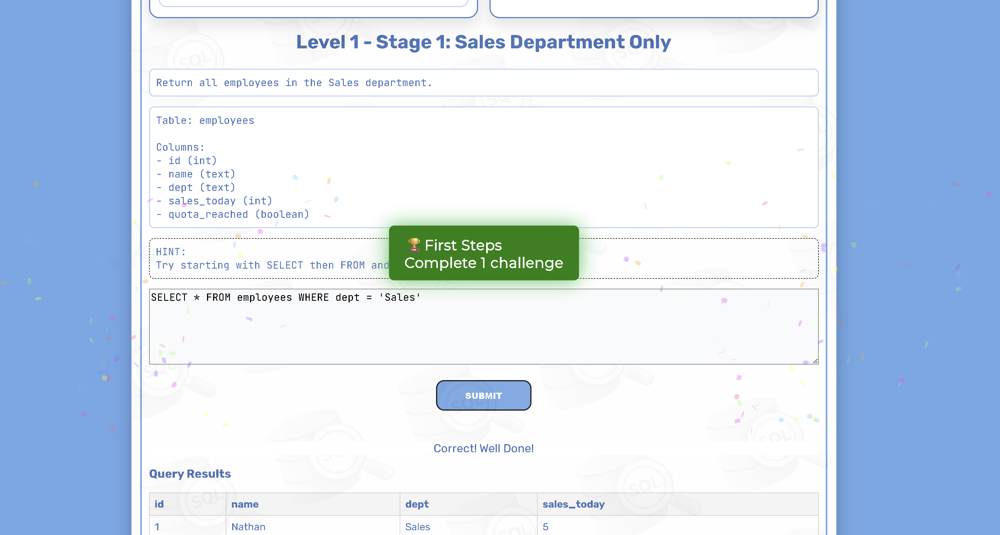
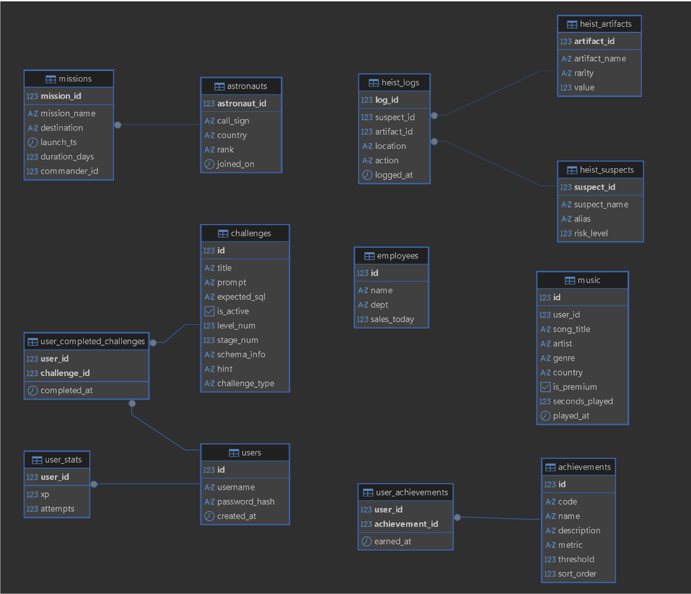

# SQL Solver

A gamified web application for learning SQL through interactive, level-based challenges. Built as an individual honours project, focused on improving SQL learning through gamification (achievements, XP, leaderboards) grounded in Self-Determination Theory research.

## Features

- Interactive SQL challenges across multiple difficulty levels and themes
- Real-time query validation — compares user SQL output against expected results, allowing multiple correct query structures
- XP, achievements and a leaderboard system to support motivation and engagement
- User authentication with secure password hashing (bcrypt)
- Progress tracking persisted per account
- Admin dashboard for managing users and viewing platform statistics

## Screenshots

### Challenges Page


### Progress & Achievements


### Achievement Unlocked


## Database Design


## Tech Stack

- **Frontend:** HTML, CSS, JavaScript
- **Backend:** Node.js, Express
- **Database:** PostgreSQL

## Evaluation

Evaluated through user testing with 7 participants via structured questionnaire. Average results:
- Learning effectiveness: 9.1/10
- Difficulty & progression: 8.9/10
- Engagement & motivation: 8.6/10
- Usability: 8.0/10

## Running Locally

**Requirements:** Node.js, PostgreSQL

1. Clone the repo:
   ```
   git clone https://github.com/nathan-thomson/SQLSolver.git
   cd SQLSolver
   ```

2. Install dependencies:
   ```
   npm install
   ```

3. Create a PostgreSQL database and restore the schema/data (dump file not included in this repo for size/privacy — contact me if needed, or set up your own schema based on the structure below).

4. Create a `.env` file in the project root:
   ```
   DB_HOST=localhost
   DB_PORT=5432
   DB_USER=your_pg_user
   DB_PASSWORD=your_pg_password
   DB_NAME=your_db_name
   ADMIN_USERNAME=your_admin_username
   ADMIN_PASSWORD=your_admin_password
   ```

5. Run the server:
   ```
   node server.js
   ```

6. Open `http://localhost:3000`

## Notes

This project was originally developed and deployed on university infrastructure as part of a BSc dissertation project, and has since been migrated to run fully independently with local database and environment-based configuration.
